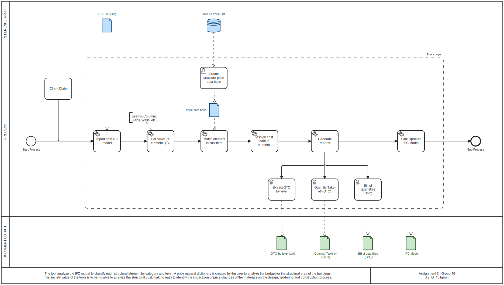

# Summary

Title: Structural Cost Estimation using Pset-based Price Lists
Category: BUILD
This tool estimates costs and enriches the IFC model with IfcCostSchedule, IfcCostItem and IfcCostValue. A matching function assigns costs based on a custom price list unit multiplied by the IfcElementQuantity for each structural element.

# Youtube Video

[Watch the Youtube tutorial video](https://youtu.be/ab2ckDVf8uE)

# Process Diagram



# Workflow of the Application

1️⃣ **Load IFC Model**  
   - The tool reads the input .ifc file from an absolute path using `ifcopenshell.open()`.
   - Extracts all building elements using `ifc_file.by_type()`.

2️⃣ **Load Price List CSV**  
   - Reads the  file containing cost data.
   - Groups rows by the "Ifc Match" column.
   - Elements with empty class names are skipped.

  ```bash
      Identification Code | Name                                        | IfcMatch | IfcCostValue    | Unit |
      04.10.82,01         | Betonbjælke 200 x 300 mm, ikke synlig flade | IfcBeam  | 4056,05         | m3   |
  ```

3️⃣ **Match Elements to Cost Items**  
   - For each IfcElement in the model:
     - Look up matching .csv rows by element class through IfcMatch column.
     - Use fuzzy string matching on the element's Name to find the best price list match using Python's `difflib.SequenceMatcher`.
     - Extract element properties using `ifcopenshell.util.element.get_psets()` to access property sets.
     - Extract quantities using `ifcopenshell.util.element.get_quantity()` for length, area, or volume.

4️⃣ **Assign Cost Data to Elements**  
   - Create `IfcCostSchedule` using `ifcopenshell.api.run("cost.add_cost_schedule", ...)` to organize cost items.
   - Create or reuse an `IfcCostItem` for each matched identification code using `ifcopenshell.api.run("cost.add_cost_item", ...)`.
   - Create `IfcCostValue` entities with unit costs from the .csv using `ifcopenshell.api.run("cost.add_cost_value", ...)`.
   - Link elements to cost items using `ifcopenshell.api.run("control.assign_control", ...)` to create `IfcRelAssignsToControl` relationships.

5️⃣ **Generate Reports**  
   - **Quantity Take-Off (QTO)**: Lists all elements with their quantities (extracted using `ifcopenshell.util.element` utilities), matched cost items, and unit costs.
   - **Bill of Quantities (BOQ)**: Summarizes total costs by element type and cost item, organized by building storey using `ifcopenshell.util.element.get_container()`.
   - Reports are saved as .txt files in the `output` folder.

6️⃣ **Save Updated IFC Model**  
   - All changes (new cost entities and relationships) are written to a new .ifc file using `ifc_file.write()`.
   - The output files are saved in the `output` folder and the original .ifc file is never modified.

# Instructions to run the tool

**Setup:**
1. Clone the repository:
   ```bash
   git clone https://github.com/riccardopadoan28/BIManalyst_g_46.git
   ```
2. Navigate to the A3 folder:
   ```bash
   cd BIManalyst_g_46/A3
   ```
3. Install required dependencies:
   ```bash
   pip install -r requirements.txt
   ```
   
**Usage:**
1. Run the application:
   ```
   python A3_TOOL.py
   ```
2. Enter the path to your .ifc model.
3. Enter the path to your price list .csv file.
4. The tool will process the model, assign cost data, generate reports, and save the documents in the `output` folder.